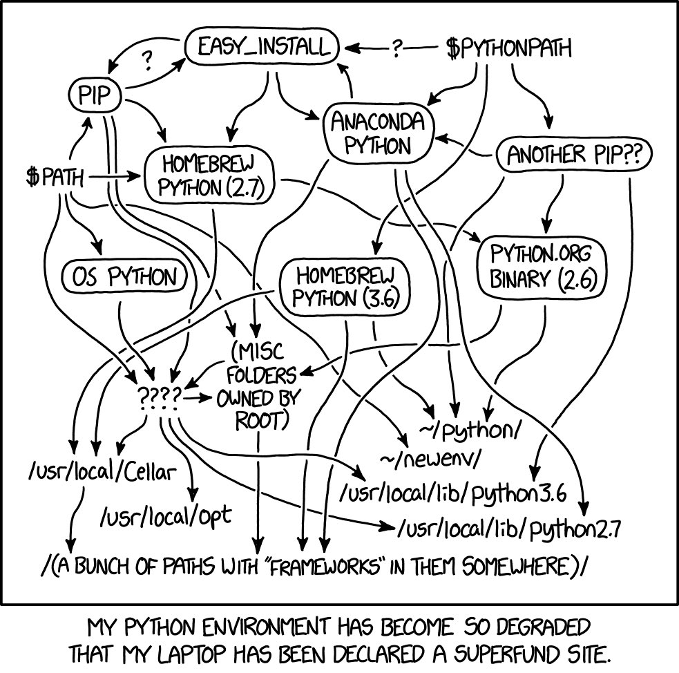
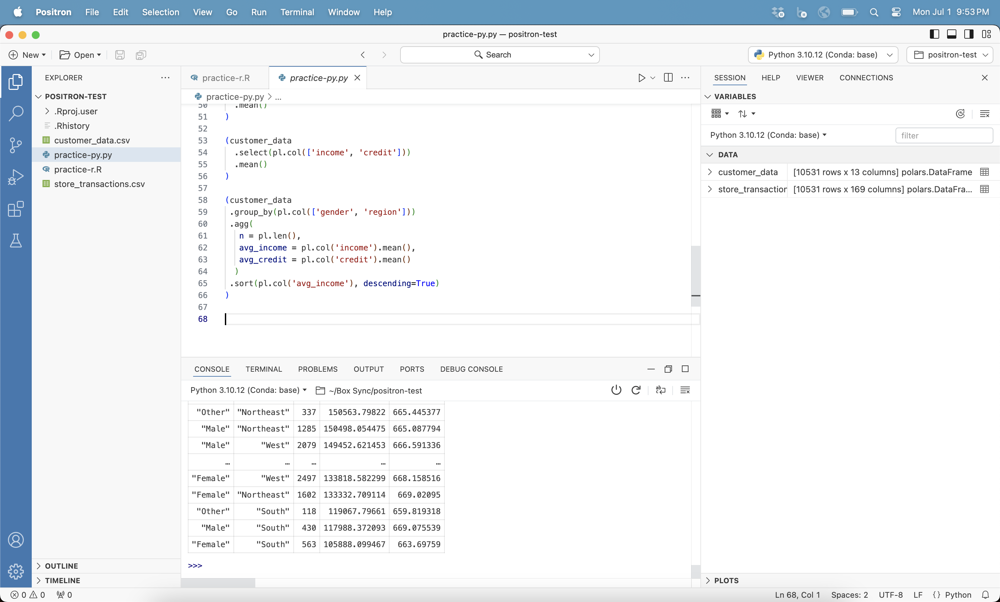
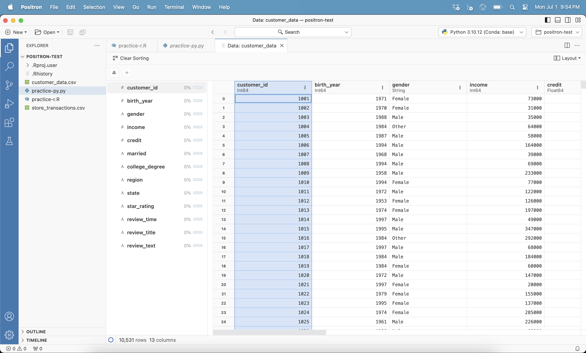
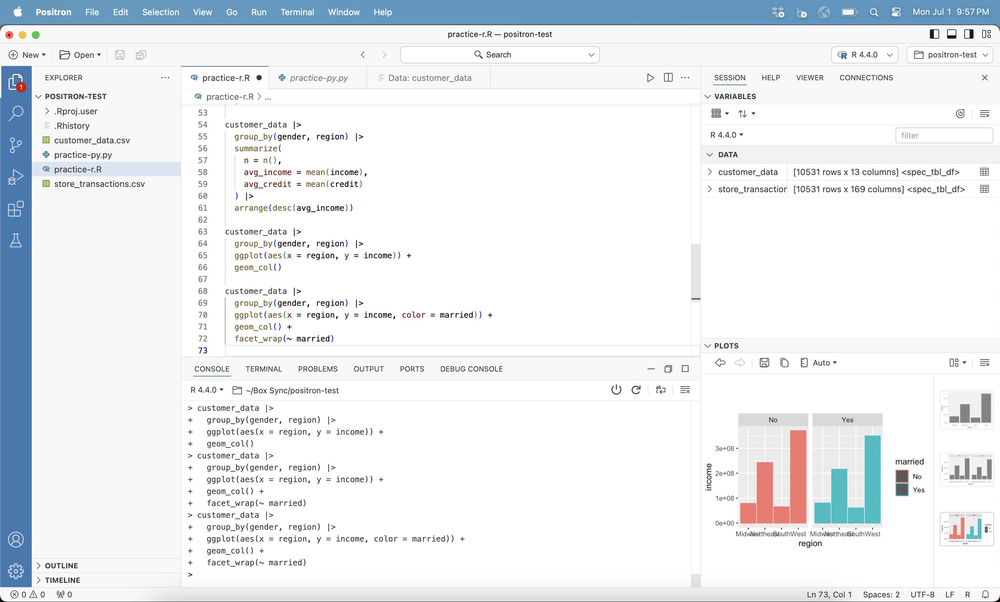
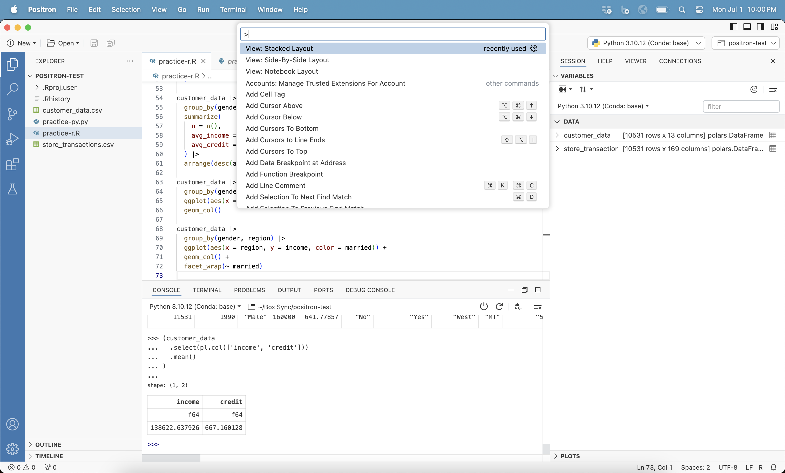
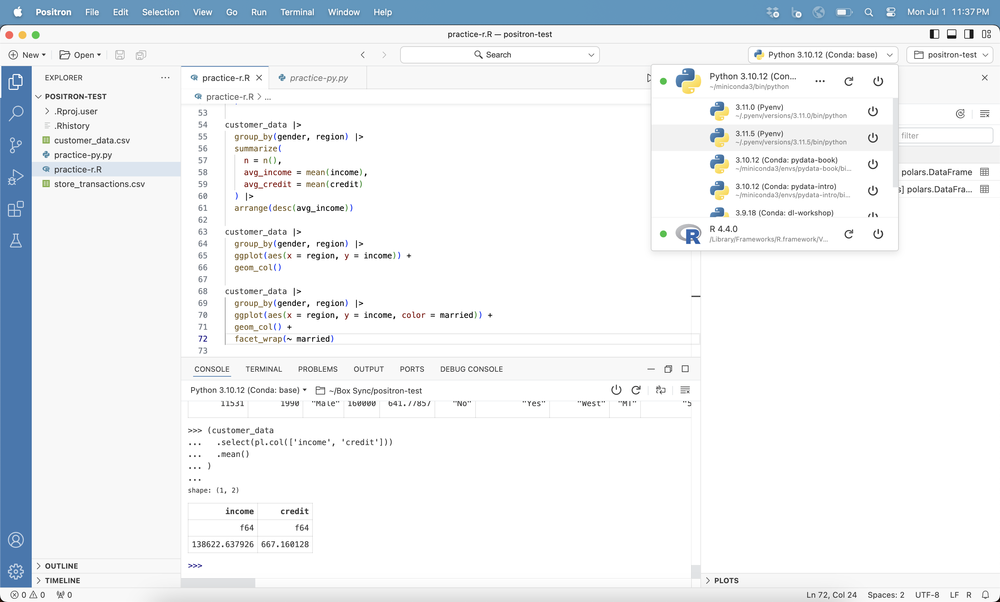
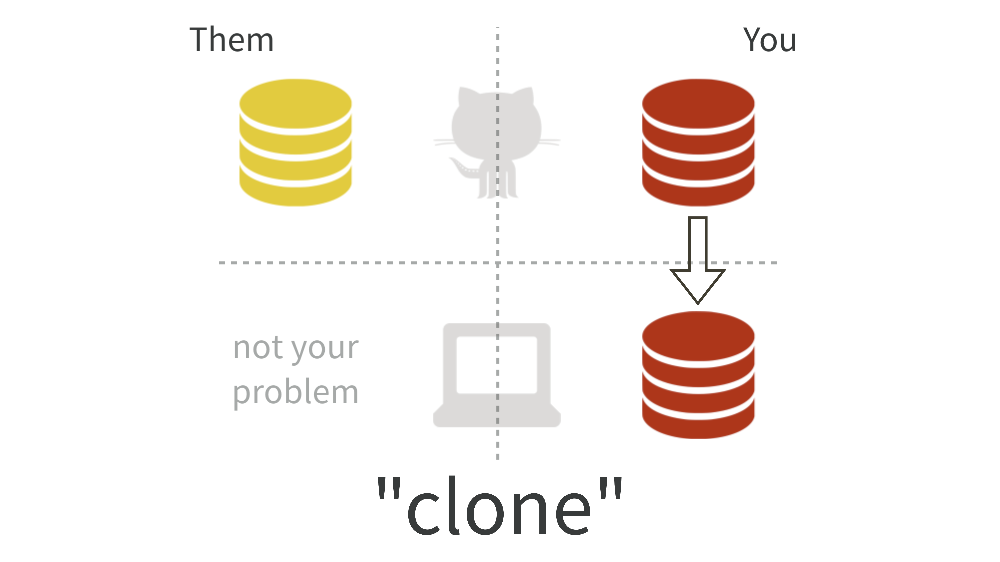
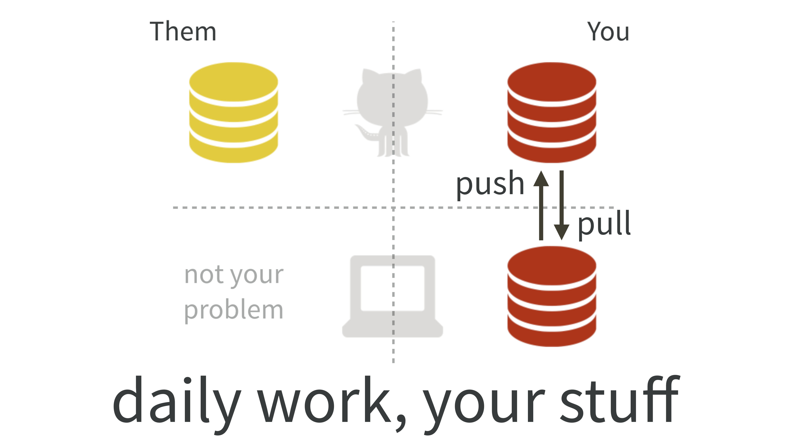
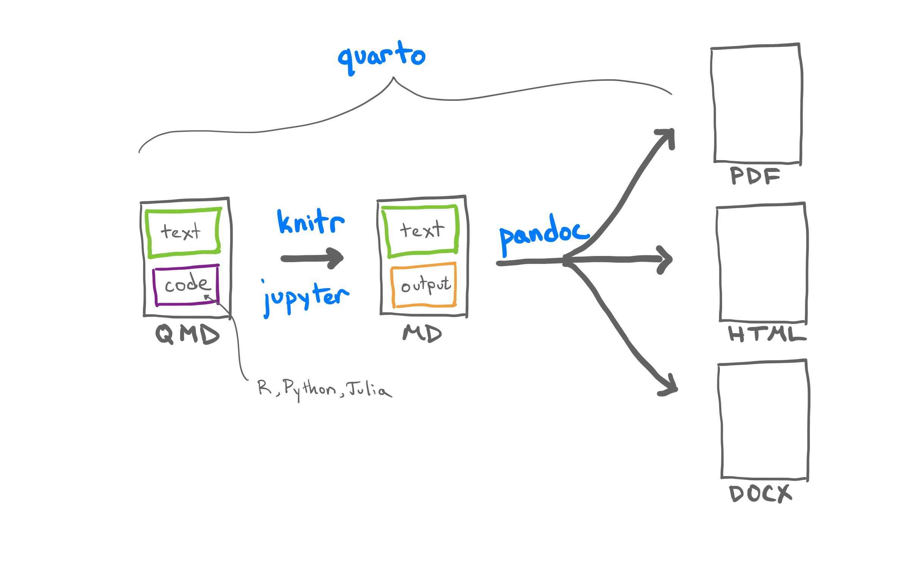

# ASC Training

This repository is a collection of training resources for students
working on projects at the [Analytics Solutions
Center](https://huntsman.usu.edu/asc/) (ASC). The ASC collaborates with
sponsor organizations to provide students at the [Jon M. Huntsman School
of Business](https://huntsman.usu.edu), and [Utah State
University](https://www.usu.edu) at large, with real-world experiences
working on data-related projects. Each ASC project is mentored by a
faculty member from the [Data Analytics and Information Systems
Department](https://huntsman.usu.edu/dais/). The following training is
provided for students on projects that I mentor.

## Python

Installing Python can be challenging, even for advanced users. As
immortalized by xkcd:

Notably, Python comes pre-installed on some operating systems (OS). This
version *should not be used* by anyone except the OS itself. For this
and other reasons, we need the ability to maintain multiple versions of
Python on the same computer. Python is a big tent, and there are many
ways to install and maintain versions. I recommend using
[pyenv](https://github.com/pyenv/pyenv), a Python version management
tool that is designed to be as *simple* as possible, though what
constitutes “simple” is a matter of experience and your mileage may
vary.

> [!TIP]
>
> ### The Command Line
>
> Using pyenv will require you to use the command line (i.e., terminal
> or shell). Be patient and *take your time* walking carefully through
> the [installation
> instructions](https://github.com/pyenv/pyenv?tab=readme-ov-file#installation).
> Daniel Chen, who introduced me to pyenv, also has a [great
> write-up](https://chendaniely.github.io/python_setup/210-python_install.html)
> of the installation instructions that may be a bit easier to follow. A
> few things to help as you install:
>
> - The command line is the programming interface into your OS itself.
>   You don’t have to know everything about it to follow instructions.
> - When you get to the section [Set up your shell environment for
>   pyenv](https://github.com/pyenv/pyenv?tab=readme-ov-file#b-set-up-your-shell-environment-for-pyenv),
>   the instructions are different based on the *type* of command line.
>   If you’re on a Mac that’s running macOS Catalina 10.15.7 or later,
>   the terminal is Zsh. If you’re using Linux, the shell is Bash (and
>   you probably already know that). And if you’re using Windows, you’ll
>   be using the [pyenv-win](https://github.com/pyenv-win/pyenv-win)
>   fork with PowerShell.

Now that you have pyenv installed, you can install and manage all the
versions of Python on your computer. To see what versions you already
have installed, on the command line, run `pyenv versions`. At first this
is probably just the OS version. Note that if you’ve installed Python
before pyenv, it won’t be listed: `pyenv versions` will only list the OS
version and any additional versions you install using pyenv. To see all
the available versions of Python that you can install, run
`pyenv install --list`. This can be overwhelming, but a good place to
start is the latest version of Python that has a stable release (i.e.,
doesn’t have a `-dev` tag). For example, to install Python 3.12.4, run
`pyenv install 3.12.4`.

Remember how you shouldn’t use the OS version of Python? Set the global
default version of Python that you’ll use (leaving the OS to do it’s own
thing). For example, to set Python 3.12.4 as the global default version,
run `pyenv global 3.12.4`. If you run `pyenv versions` again you should
see an asterisk by the global default you specified.

There’s a lot more that [pyenv can
do](https://realpython.com/intro-to-pyenv/), but now you should be set
to safely install and manage Python.

## Positron

An integrated development environment (IDE), outside of an open source
language, is arguably your most important tool as a data analyst or data
engineer. There are many options, but I recommend
[Positron](https://positron.posit.co), a next-generation data science
IDE. Built on VS Code’s [open source
core](https://github.com/microsoft/vscode), Positron combines the
multilingual extensibility of [VS Code](https://code.visualstudio.com/)
with essential data tools common to language-specific IDEs.

While Positron is still in active development, it’s stable enough for
our work. After installing Python using pyenv (and specifying a non-OS
version as a global default), go ahead and
[download](https://positron.posit.co/download.html) and install
Positron.

While there is a [guide](https://positron.posit.co/interpreters.html)
for Positron, the following highlights some of the essential
functionality. Note that since Positron is built on VS Code’s open
source core, VS Code’s excellent
[documentation](https://code.visualstudio.com/docs) remains largely
relevant.

### Console and Session

If you’ve used VS Code, Positron’s layout will look familiar. The
explorer on the left shows the folder you have open, which also
establishes your working directory, and the central pane is where you
type and run code. Two obvious differences are the integrated console
(in the bottom pane by default) and the session information (in the
right pane by default), which includes details of the variables and data
that have been loaded.

The console is where the code executes while the terminal (i.e., command
line, also in the bottom pane by default) has the folder you have open
in the explorer *already identified as the working directory*. The
variables and data in the session information help you keep track of
what you’re working with.

### Data Explorer

You can click on any data you have loaded (or even CSV or Parquet files
in the explorer without importing first) to open the data explorer.

The data explorer is designed to facilitate coding, not replace it. The
data explorer provides a summary of the data and allows you to quickly
sort and filter the data so you can get back to programmatically going
about data wrangling.

### Plots

Along with variables and data, the session information has a dedicated
location for plots, including a history gallery to click through and
easily compare previous plots. This also includes support for
interactive plots.

### Command Palette

The command palette is the primary way to manage options (e.g., pane
layout views and themes) and is a mainstay of the shortcut-heavy VS
Code. Open with Cmd/Cntrl + Shift + P.

### Interpreter Selection

You can use the drop-down in the top right to select intepreters,
including Python versions and other languages you have installed.

### Help

Including a question mark after most any command will open the help (in
the right pane by default). This serves as a built-in browser to allow
you to reference online documentation, including parameter definitions
and examples you can copy and use.

## GitHub

Git is a powerful collaboration and [version control
system](https://peerj.com/preprints/3159v2/). While it is the industry
standard for software development, we can easily adopt this framework to
provide structure for any kind of research, ASC projects included.
GitHub is an online hosting service where each project lives in its own
repository maintained by me as the mentor. After a project is completed,
you can copy (i.e., *fork*) the project repository for you to maintain.
Learning to use Git and GitHub not only aids in collaboration, it will
ultimately allow you to develop an online portfolio of work.

To get started, you’ll need to [register a GitHub
account](https://happygitwithr.com/github-acct#github-acct) and install
Git [using the command
line](https://happygitwithr.com/install-git#install-git) (substituting R
references with Python and RStudio with Positron) or [downloading the
latest source](https://git-scm.com/downloads). You’ll also need to both
[introduce yourself to Git](https://happygitwithr.com/hello-git) (using
the email associated with your GitHub account and substituting R
references with Python and RStudio with Positron) and then authorize
Positron to use your GitHub credentials (which you *should* be prompted
to do when cloning your project repository below). Note that when you
get a prompt from Positron to use `Git: Fetch` automatically, go ahead
and select yes. This will allow your local Git to be aware of updates,
including new branches, on GitHub.

Your project repository will be based on my
[asc-template](https://github.com/marcdotson/asc-template) to provide
consistency across projects. I will need to add you as a collaborator to
the project repository. Note that there are certain limitations to the
size and type of files that can be hosted (i.e., *pushed* to GitHub).
There are also certain things that shouldn’t be accessible by the public
(e.g., data we are under NDA to access). For these reasons, we have
files and folders that are pushed to GitHub and those that are not.
Here’s how the project repository is organized:

- `/code` Scripts with prefixes (e.g., `01_import-data.py`,
  `02_clean-data.py`) with functions in `/code/src`.
- `/data` Simulated and real data, the latter not pushed.
- `/figures` PNG images and plots.
- `/output` Output from model runs, not pushed.
- `/presentations` Presentation slides.
- `/private` A catch-all folder for miscellaneous files, not pushed.
- `/writing` Case studies.
- `/.venv` Hidden project library, not pushed.
- `.gitignore` Hidden Git instructions file.
- `.python-version` Hidden Python version for the reproducible
  environment.
- `requirements.txt` Information on the reproducible environment.

Any file or folder that begins with a period is hidden (i.e., you won’t
see it in your OS file explorer by default, but you will see it in the
explorer in Positron). The `.gitignore` file is what controls which
files and folders are pushed.

### Issues

To stay organized, we will manage the project by keeping track of
assigned tasks using GitHub’s issues (see the tab at the top of the
project repository on GitHub). We can have an ongoing conversation there
about each specific issue and close them out when a given issue is
completed or resolved. Be sure to tag collaborators you want to see a
specific comment (e.g., `@marcdotson`). Think of this as an email thread
or Teams channel except all of the conversations are in one place,
easily searchable, and automatically archived as part of the version
control.

### Clone

Once you are a collaborator on the project repository, you can *clone*
it. Cloning simply means you’re creating a local copy of the repository,
though the clone isn’t just a copy of the folder. Git still works in the
background keeping track of changes and managing the version control.
Follow the [Clone a repository
locally](https://code.visualstudio.com/docs/sourcecontrol/intro-to-git#_clone-a-repository-locally)
to clone the project repository.

You only need to clone the project repository one time. Please note that
any of the files and folders that aren’t pushed to GitHub can be created
in your cloned repository without any impact on the repository hosted on
GitHub. For example, I typically store PDFs of papers and other related
materials that I don’t want to (or can’t) share in the `/private` folder
so that the resources I need are all within the same directory on my
computer.

> [!IMPORTANT]
>
> ### Reproducible Environments
>
> Now that you’ve cloned the project repository, we can finish setting
> up a *reproducible environment*. An environment is composed of Python
> and the libraries (including the library dependencies) used for a
> given project. What makes an environment reproducible is keeping track
> of which *version* of Python and the libraries we’re using for a given
> project. While “keeping track” could happen in many different ways,
> ideally we want to keep track of our environment such that it can be
> easily *reproduced* on another machine, by you (including future you)
> or someone else. For our purposes, we need to be sure that everyone
> working on our project, including anyone at the sponsor organization,
> can easily reproduce our environment and run the associated code.
>
> You might be wondering why we need to keep track of Python and library
> versions. Here are two reasons:
>
> - Not all Python versions are (or were) backwards compatible.
> - Functions, methods, and parameters get modified or deprecated.
>
> In other words, just because our project code works now doesn’t mean
> that it will work for someone else or in the future. Ensuring our
> project environment is reproducible enables collaboration and
> future-proofing. There are many ways to maintain a reproducible
> environment. I recommend using pyenv and
> [venv](https://docs.python.org/3/library/venv.html) to keep track of
> Python and library versions, respectively.
>
> #### `.python-version`
>
> Just like we specified a global default version of Python using pyenv,
> we can also specify a *project* default version of Python using pyenv
> as part of our reproducible environment. Note that this has already
> been done as part of the
> [asc-template](https://github.com/marcdotson/asc-template). However,
> to do this on your own or to modify an existing project default Python
> version, go to the terminal in Positron after opening the cloned
> repository in the explorer and run `pyenv local 3.12.4`, assuming you
> want Python 3.12.4 to be set as the default. This would create (or
> modify) a `.python-version` file in that directory that specifies the
> version of Python to use for the project.
>
> This `.python-version` file is simple and small enough to be pushed to
> GitHub. When you open the cloned project repository in Positron, the
> interpreter selection should change to the Python version you’ve
> specified in the `.python-version` file.
>
> #### `requirements.txt`
>
> By default, all libraries are installed in a single, global library on
> your computer known as the *system library*. What we need is a
> *project library*. This helps highlight an important feature of
> reproducible environments: Each project will have its own project
> library and thus be *isolated*. If two projects use different versions
> of the same package, they won’t conflict with each other because
> they’ll each have their own project library. Well, not exactly. Python
> employs a global cache to avoid having to install the same version of
> a given library more than once. (Note that if you’ve installed Python
> prior to using pyenv, you may have a global cache that is borked. You
> can run `pip cache purge` in the command line to start fresh.)
>
> The venv library comes pre-installed with Python as the default
> reproducible (or *virtual*, hence the “v” in venv) environment
> management tool. It works in two steps. First, we must create a
> project library. Second, we keep track of the versions of the
> libraries we use. Note that this has already been *started* as part of
> the [asc-template](https://github.com/marcdotson/asc-template). The
> project library is stored in the `/.venv` folder, a hidden folder
> listed in the project organization. It isn’t simple or small, so it’s
> not something we push to GitHub. However, the `requirements.txt` file
> is what keeps track of the library versions and is a file that can be
> pushed to GitHub.
>
> To put it another way, we use `requirements.txt` to recreate the
> needed project library in our cloned repository in the same way we use
> `.python-version` to know what Python version to use. Simply go to the
> terminal in Positron after opening the cloned repository in the
> explorer and run `python -m venv .venv` to create the `/.venv` project
> library, followed by `pip install -r requirements.txt` to install the
> specified library versions. Note that whenever you install new
> libraries or decide to update the versions of libraries you use, run
> `pip freeze > requirements.txt` to update `requirements.txt`.

### Branches

Remember that Git and GitHub are built for software development.
Following that analogy, Git operates through the use of
[*branches*](https://code.visualstudio.com/docs/sourcecontrol/intro-to-git#_using-branches).
Each branch in a repository is a separate version of the repository that
exists in parallel and is focused on a specific issue. For example, we
could have a branch called `initial-model` and another branch called
`data-cleaning`. For version control to be useful, we need to be concise
and descriptive with branch and other naming conventions (i.e., no
`final-final-draft-02` nonsense here).

Every repository has a `main` branch. If this were software, the `main`
branch would be the branch that is being used in production. *Never make
changes directly to the `main` branch.* You can see which branch you’re
working in by looking at the bottom left corner in Positron. Assuming
the branch you need to work on has already been created, the first thing
you should do when starting to work is navigate to the branch you want
to work in. Use `Git: Checkout to...` via the command palette to select
the correct branch.

### Commit, Push, and Pull

You’ve identified what you need to work on using issues, cloned the
project repository and set up the reproducible environment, and made
sure you’re working on the correct branch. Finally, you can get to work!
Then what? Once you’ve made a number of changes to your cloned project
respository, how do you share that with your collaborators? If you click
on the source control tab below the explorer (by default in the left
pane in Positron) you’ll see all of the files you’ve changed. You first
need to *stage* these changes using the plus sign next to the files. You
then need to provide a *commit message*. Like the branch names, these
should be short and descriptive, like “Created a function to parse text
data” or “Cleaned up errors to the final model”.

It is the branch names and these commit messages that provide a record
of the work we have done. With a descriptive message, you are ready to
[*commit*](https://code.visualstudio.com/docs/sourcecontrol/intro-to-git#_staging-and-committing-code-changes).
This is like saving a file, except we can save multiple files all at
once associated with the commit message we’ve written. These changes are
now archived as part of the version control on our cloned project
repository. To share them with our collaborators, we need to *push* them
to the repository on GitHub. Similarly, to get changes others have
pushed, we need to *pull* them from the repository on GitHub. In
Positron, this is often summarized as one step called *sync*, which is
pulling and then pushing sequentially.

To summarize, your daily work in Positron will look like this:

- Open the cloned project repository in the explorer pane to set your
  working directory.
- Make sure you’ve checked out the correct branch to work in (he branch
  name you’ve checked out is in the bottom left corner).
- Pull changes that have been pushed since you last worked on the
  project using the sync button in the source control pane or next to
  the branch name in the bottom left corner.
- Once you’ve done some amount of work, stage and commit changes with a
  descriptive message in the source control pane.
- Push changes using the sync button in the source control pane or next
  to the branch name in the bottom left corner.

### Pull Requests

When you’ve completed work on the issue associated with the branch,
create a [*pull
request*](https://code.visualstudio.com/docs/sourcecontrol/intro-to-git#_creating-and-reviewing-github-pull-requests)
on GitHub and tag me (i.e., `@marcdotson`). A pull request is exactly
what it sounds like – a request submitted to the repository maintainer
to pull the changes you’ve made. This allows me to review what you’ve
done, have a conversation with you about it as part of the pull request
itself (which looks a lot like an issue tied specifically to the pull
request), and eventually pull what you’ve done into `main`. I’ll then
delete the branch specific to that issue and close out the associated
issue.

Note that when a branch is deleted on GitHub, it will still exist in
your cloned repository. This isn’t necessarily a problem, though if you
commit changes to a closed branch it will force the branch open again.
Again, make sure you’re working on the correct branch. Eventually you
may want to clean up branches that have been merged into `main` and
closed on GitHub by using `Git: Delete Branch...` via the command
palette, followed by the branch name. You may also need to use
`Git: Fetch` to prune tracking branches that are no longer on remote
(i.e., on GitHub).

## Quarto

[Quarto](https://quarto.org) is an open-source publishing system where
we can combine text along with code and its output. If you’ve used
Jupyter notebooks, Quarto documents will be familiar. However, the most
important difference is that the notebook format of a Quarto document is
simply a means to and end. Quarto is built using a sophisticated tool
called Pandoc that can take whatever we produce within the Quarto
document and render it into a Word document, PowerPoint presentation,
PDF, Revealjs slide deck, interactive dashboard, website, etc. Browse
through the [gallery](https://quarto.org/docs/gallery/) to see what sort
of things are possible.

Quarto is a command line tool that is also available as an extension
that comes pre-installed with Positron. The
[asc-template](https://github.com/marcdotson/asc-template) used to
produce our project repository has Quarto documents (e.g., `README.qmd`)
used throughout. Whenever you make a change to a Quarto document, render
the document into its output and a preview of the rendered document will
appear in the viewer (in the right pane by default). If you are using
Python within the Quarto document, Quarto will render the output using
the Jupyter kernel in the background.

Please note that a Quarto can be used in conjunction with a [Jupyter
notebook](https://quarto.org/docs/get-started/hello/jupyter.html) to
render into all of these different outputs via Pandoc as well. However,
just because we can doesn’t mean we should. For most of the code we
produce, we should use flat text Python `.py` scripts. We use Quarto
when we want to produce a GitHub page, report, presentation, dashboard,
etc.

### YAML

The header at the top of any Quarto document is coded in *YAML* (i.e.,
Yet Another Markup Language), which follows a simple `key: value`
syntax. For most Quarto documents in a project repository, you should
set `format: gfm`. When you render your Quarto document, it will create
a separate markdown document using “GitHub Flavored Markdown” that
GitHub can parse. For example, the header for this document is:

    ---
    title: "ASC Training"
    format: gfm
    ---

### Markdown

Quarto documents use
[markdown](https://quarto.org/docs/authoring/markdown-basics.html), just
like in Jupyter notebooks. Markdown is a simple, generic typesetting
syntax. Note that GitHub recognizes this syntax, including in issues and
pull requests.

Sometimes working with markdown alone can be challenging. Positron
includes a visual mode you can access by right-clicking inside any
Quarto document. The visual mode includes some GUI options to help you
produce the markdown syntax, which can be especially helpful for things
like [tables](https://quarto.org/docs/authoring/tables.html) and
[citations](https://quarto.org/docs/authoring/citations.html).

### Code

Quarto allows us to include [code
blocks](https://quarto.org/docs/computations/python.html) and output as
part of the document. Much like Jupyter notebooks, you can include
Julia, Python, and R code (Jupyter stands for *Ju*lia, *Py*thon, and
*R*) as well as C++, Stan, and other code blocks and output.

There are a variety of options for each code block. In addition to
specifying the language used within the code block, the code block can
be given an identifier, can have warnings suppressed, can run without
producing output, etc. These options are specified using YAML syntax
following the hashpipe operator `#|` within the body of the code block.
Any code block YAML that should apply to the document in its entirety
can simply be moved into the header YAML.

### Parameters

Ever have to go through and manually change any data or model output
referenced in a report? Not only is this costly and error prone, but it
is the definition of non-reproducible.
[Parameters](https://quarto.org/docs/computations/parameters.html) in
Quarto help solve part of this problem.

Parameters for Quarto documents using the Jupyter kernel are included in
a flagged code block:

    #| tags: [parameters]

    name = 'Analytics'
    mean = 3.2
    data = read_csv('/data/analytics_data.csv')

Parameter values can then be referenced in the document (including code
blocks) using the parameter name.

### References

We can specify a bibliography in the header:

    ---
    title: "Research Assistant Training"
    format: gfm
    bibliography: references.bib
    ---

We can can use the bibliography `references.bib` to include regular
single-paper citations using `[@citation]` or multiple-paper citations
using `[@citation; @citation]`, in-line citations using `@citation`, or
citations without the Author using `[-@citation]`.

Additionally, each section and sub-section can be referenced by adding a
`#sec` identifier to any heading and referencing `@sec`. For example,
`## Introduction {#sec-intro}` would be referenced as `@sec-intro`.

### Equations

If you need to include any math, you shouldn’t be surprised that there’s
a typesetting syntax for that. It’s called
[LaTeX](https://www.latex-project.org) (pronounced “lah-tech” or
“lay-tech”) and our primary interest is using it’s [math
syntax](https://oeis.org/wiki/List_of_LaTeX_mathematical_symbols). Use
`$` around any in-line LaTeX notation or `$$` around equations specified
as a separate line. For example, we can reference
$p(\theta | X) \propto p(X | \theta) \ p(\theta)$ in-line as well as
centered on its own:

$$
p(\theta | X) \propto p(X | \theta) \ p(\theta)
$$
