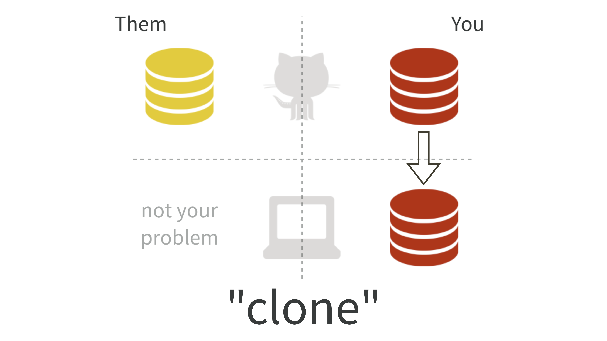

Research Assistant Training
================

## Using GitHub

GitHub is a powerful collaboration and version control tool. We will be
using it for *project management*, *writing*, and *coding*.

### Project Management

By project management I primarily mean keeping track of assigned tasks
using the **Issues** tab on GitHub. We can have an ongoing conversation
here about each specific issue and close it out when its completed or
resolved. Be sure to tag collaborators you want to see the conversation
(e.g., `@marcdotson`). Think of this as an email thread or Slack channel
except all of the conversations are in one place, easily searchable, and
automatically archived.

### Writing

Think of using GitHub to collaborate on writing as using something like
Google Docs. It is essential that we document what we’re doing in each
project as we do it. This is true for a number of reasons.

1.  Writing forces you to think clearly about what you’re doing.
2.  If you’re coding, think of the associated writing as long-form
    comments.
3.  The final product of any project is going to be a paper, so start
    writing it now.

GitHub supports **markdown** syntax, which you’re probably more familiar
with than you might expect from time spent with **R Markdown**. Here are
some [markdown
basics](https://rmarkdown.rstudio.com/authoring_basics.html). We will be
writing using *parameterized* R Markdown so we can easily reference
model output instead of including it manually. See below for more on
using R Markdown.

### Coding

GitHub was created for software development. While we may not actually
be developing software, we will be importing, wrangling, visualizing,
and modeling data using code, and it’s going to be essential for
everyone to be on the same page. Even if you were just working solo, you
will be collaborating with your past self and you should do yourself a
favor and impose good version controls on your code.

### Set-Up

To get started, complete Jenny Bryan’s [pre-workshop
set-up](https://happygitwithr.com/workshops.html?mkt_tok=eyJpIjoiT1RVelptVTNZams0T0dZMiIsInQiOiJlR0orVlVpaHZsRlwveWh5QUJPN2U1Q3BcL0pHVHo5RXJ5UkhabFlwVXM4NlEwcHhRTENQZmVxaEEyNnVLSkRFTTdVa0hyNjk4MkFHYUU1Nkt5VXNtRm9heFM3N3dnUFplZ1V5anpRTWdnWDVscE1lOUR6VzBHaGFQOUFhOGd1QkN3In0=#pre-workshop-set-up).
This can take up to a few hours, so plan accordingly. Note that the
following Git and GitHub training draws heavily from Jenny Bryan’s
training on using Git and GitHub from rstudio::conf(2019).

### GitHub Basics

Now that you’re set up, let’s get started.

#### Just Once: Clone

First **clone** one of your repos, or a repo that you’re a collaborator
on. This is simply creating a local copy of the repo. You do this inside
RStudio by creating a new project and selecting `Version Control > Git`.

#### Daily Work: Commit, Push, Pull

Now you can open up the RStudio Project in the local, cloned repo and
work on the project. You have a new Git pane in RStudio that notifies
you that changes you’ve made means you are out-of-sync with the
**remote** repo (i.e., the one on GitHub). Once you’ve made a number of
changes, you click on the files you want to **commit** and click commit.
Think of a commit as saving a snapshot of all of the changes you’ve made
across these files all at once. Include a clear commit message. You’ll
do this fairly frequently for your local repo.

Eventually you’ll be ready for other people to have access to your
changes on the remote repo. To do this, you’ll click on the green up
arrow to **push** your changes to the remote repo. You push far less
often than you commit, maybe once a work session, since this means you
think it’s ready for others to have access to. Each time you push, all
of your commits are archived on the remote repo, including the **diff**
or the side-by-side comparison of what changes you made to the previous
version.

When you start a new work session, you’ll want to click on the blue down
arrow to **pull** the latest changes from the repo, possibly the work
other collaborators have pushed, so you’re synced.

#### Collaborating: Branches and Pull Requests

Because GitHub is very systematic in the way it manages commits, we will
run into commit errors when multiple people have changed the same thing
at the same time. To largely avoid this problem, among other things, we
will be using **branches**. Each branch is a separate version of the
repo that exists in parallel, one where you can make changes or
experiment without it affecting the working or **main** branch. In fact,
the main branch is protected so that you can’t accidentally push changes
to it.

To do your work as a collaborator, create a new branch on GitHub with a
short, descriptive name specific to the issue you’re working on (e.g.,
`paper-revision`). When you start a work session, make sure you select
the branch you want to work on from the dropdown in the Git pane in
RStudio. You can commit, push, and pull as usual to the branch you’re
working on. This will largely avoid commit errors because each
collaborator on a project should be working on a different issue and,
therefore, a different branch. When you’ve completed work on the issue
associated with the branch, create a **pull request** on GitHub and tag
me (i.e., `@marcdotson`). This allows me to review what you’ve done,
have a conversation with you about it, and eventually pull what you’ve
done into the main branch. I’ll then delete the branch specific to that
issue. Rinse and repeat.

### Cleaning Up Branches

While your daily work won’t require you to write any Git code,
*eventually* you’ll need to clean up the branches you have on your
clone. You’ll need to do this from the command line Terminal. I
recommend you use the one available in RStudio once you’ve opened the
project you want to clean up.

-   In the Terminal, type `git branch --merged` to see which branches
    have been merged into **main** and can be deleted from your local
    clone.
-   Then type `git branch -d <branch>` where `<branch>` is replaced with
    the name of the merged branch that you’d like to remove from your
    clone.
-   Finally, use `git fetch -p` to prune remote-tracking branches that
    are no longer on remote (i.e., on GitHub).

Voila! A cleaned up branch drop down in your Git pane makes things
easier to navigate.

### Links

-   [Happy Git and GitHub for the useR](https://happygitwithr.com)
-   [What They Forgot to Teach You About R](https://whattheyforgot.org)

## Using R Markdown

R Markdown is a powerful typesetting tool. Instead of writing in Word or
a Google Doc, by using R Markdown we can include code chunks,
parameterize the document to easily replicate reports, and output our
work as Word documents, PDFs, PowerPoint presentations, HTML slide
decks, GitHub pages, etc.

### Markdown

Markdown is a simple, generic typesetting syntax. Here is some [markdown
syntax](https://rmarkdown.rstudio.com/authoring_basics.html). GitHub
recognizes all of this syntax, including in Issues and pull requests.

### R Markdown

R Markdown allows us to include R code chunks and output as part of the
document. In other words, this is what we need to create reproducible
reports. You can also include Python, C++, Stan, and other code chunks
and output.

### Pandoc

Pandoc is the typesetting software behind the scenes that allows us to
take an R Markdown document and output it as nearly anything.

### R Markdown Basics

#### YAML

The header at the top of any R Markdown document is coded in **YAML**
(i.e., Yet Another Markdown Language). For most R Markdown document in a
project repo, you should set to `output: github_document`. When you knit
changes to your R Markdown document, it will create a separate markdown
document that GitHub can parse. For example, the YAML for this document
is:

    ---
    title: "Research Assistant Training"
    output: github_document
    ---

#### Parameters

Ever have to go through and manually change any data or model output
referenced in a report? Not only is this costly and error prone, but it
is the definition of non-reproducible. Parameters in R Markdown help
solve part of this problem.

Parameters are included as part of the YAML:

    ---
    title: "Research Assistant Training"
    output: github_document
    params:
      year: 2019
      data: "year_2019.rds"
    ---

Parameter values can then be referenced in the report (including code
chunks) using the parameter name. For example, reference `params$year`
within an R code chunk to print the year specified as a parameter or
load the data specified as a parameter by referencing
`data <- read_rds(params$data)` within an R code chunk.

Much like the rule-of-thumb regarding functions (i.e., if you have to
copy and paste more than twice, create a function), if you find yourself
copying and pasting a value that you may need to update (or change to
create a report for a different audience), add it as a parameter.

#### References

We can specify a bibliography in the YAML:

    ---
    title: "Research Assistant Training"
    output: github_document
    bibliography: references.bib
    params:
      year: 2019
      data: "year_2019.rds"
    ---

We can can use the bibliography `references.bib` to include regular
single-paper citations using `[@author:year]` or multiple-paper
citations using `[@author:year; @author:year]`, in-line citations using
`@author:year`, or citations without the Author using `[-@author:year]`.

Additionally, each section and sub-section can be referenced using an
automatically generated label using `\@ref(section-name)`. For example,
we can reference the Model Specification section using
`\@ref(model-specification)`.

#### Code Chunks

There are a variety of options for each code chunk. In addition to
specifying the language used within the code chunk, the code chunk can
be named, can have warnings suppressed, can run without producing
output, etc.

#### Tables and Figures

Using R Markdown means we can use Markdown, R, and LaTeX (along with
other languages) interchangeably. While we can create a table using
LaTeX or Markdown, we can also just print a data frame using
`knitr::kable()` and the `kableExtra` package. The name of the code
chunk is the label that can be referenced with `\@ref(tab:label)`. For
more table options, see the [kableExtra
vignette](https://haozhu233.github.io/kableExtra/awesome_table_in_pdf.pdf).

Similarly, while we can include a figure using LaTeX or Markdown, we can
also use `knitr::include_graphics()`. Once again, the name of the code
chunk is the label that can be referenced with `\@ref(fig:label)`. The R
Markdown document can also create a plot and other figures, by default
storing the figure for use in a badly named folder in the same directory
as the R Markdown. Instead, we can place a code chunk named `opts` with
`echo=FALSE`, often just under the YAML, to direct where created figures
should be saved.

    knitr::opts_chunk$set(
      fig.path = "../Figures/"
    )

The name of the figures will match the name of the code chunk in which
it was created.

### Links

-   [R Markdown: The Definitive
    Guide](https://bookdown.org/yihui/rmarkdown/)
-   [R Markdown
    Cookbook](https://bookdown.org/yihui/rmarkdown-cookbook/)
-   [The YAML
    Fieldguide](http://ymlthis.r-lib.org/articles/yaml-fieldguide.html)
-   [LaTeX Paper
    Template](https://github.com/marcdotson/repo-template/blob/main/Writing/paper-template.Rmd)

## Project Organization

Each project has a similar organization. There are certain limitations
on the size and type of files that can be pushed to GitHub. There are
also certain things that shouldn’t be accessible by the public (e.g.,
data we have a license to access). For these reasons, we have folders
and files that are pushed to GitHub and those that are not. If you are
starting a new project, please set up the repo using the
[repo-template](https://github.com/marcdotson/repo-template).

### Pushed to GitHub

-   `/Code` Each script should do something specific (like tidyverse
    functions), have a descriptive name, and include number prefixes if
    they are meant to be run in a certain order (e.g.,
    `01_import-data.R`, `02_clean-data.R`).
-   `/Data` While all data live here, only data that are small enough
    and can be shared publicly will be pushed.
-   `/Figures` Figures live here, including images (saved as PNG files)
    and data referenced or used for tables, for use in the `README`,
    writing, and presentation.
-   `/Presentation` Slides for presentations (without any PDF knits).
-   `/Writing` The paper (using the paper template but without any PDF
    knits) and case studies on specific aspects related to the project
    (with the output set to `github_document`).
-   `README` The abstract and project organization details.

### Not Pushed to GitHub

-   `/Output` Output from model runs. These files tend to be too large.
    They are also something each user can create on their own.
-   `/Private` A catch-all folder for additional files specific to a
    project that might not have anywhere else to live.

Note that you can create `/Output` and `/Private` folders in your local
clone without worrying about them being pushed. We can further modify
the `.gitignore` file to add other folders and files that aren’t pushed
to GitHub.

## Miscellaneous Details

-   Use RStudio projects.
-   Use branches (never work on the main branch).
-   Use `here::here()` to specify files paths within R scripts.
-   Use tidyverse functions and the [tidyverse
    style](https://style.tidyverse.org) where possible.
